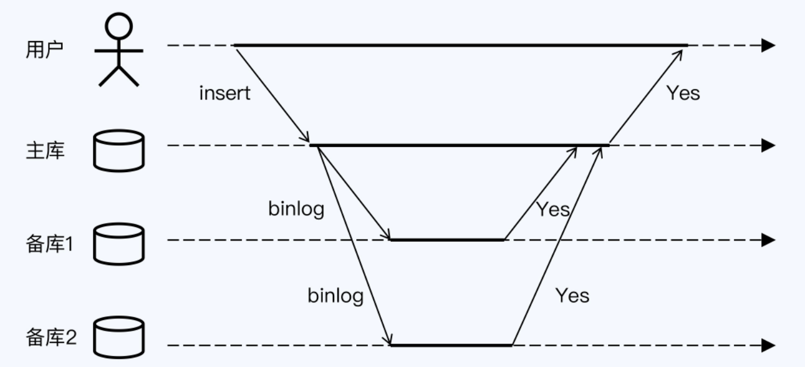
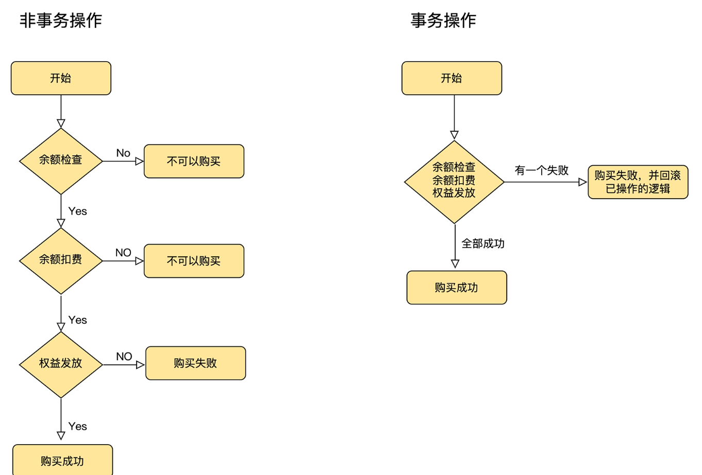
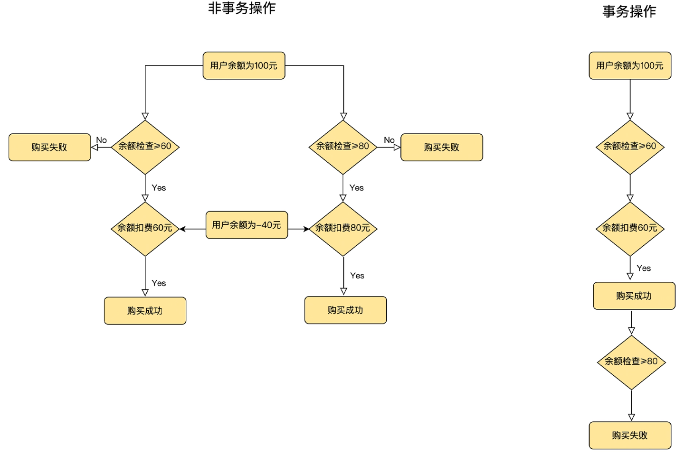
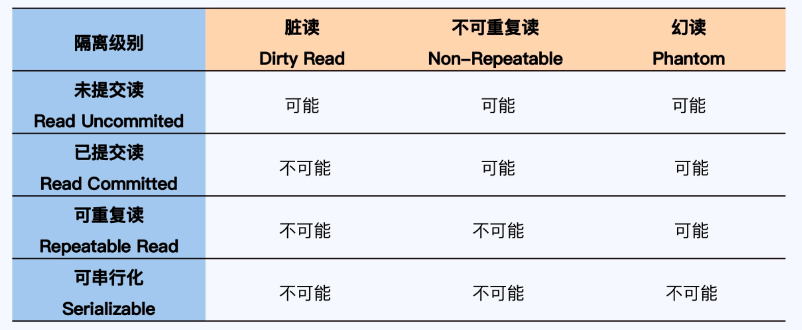
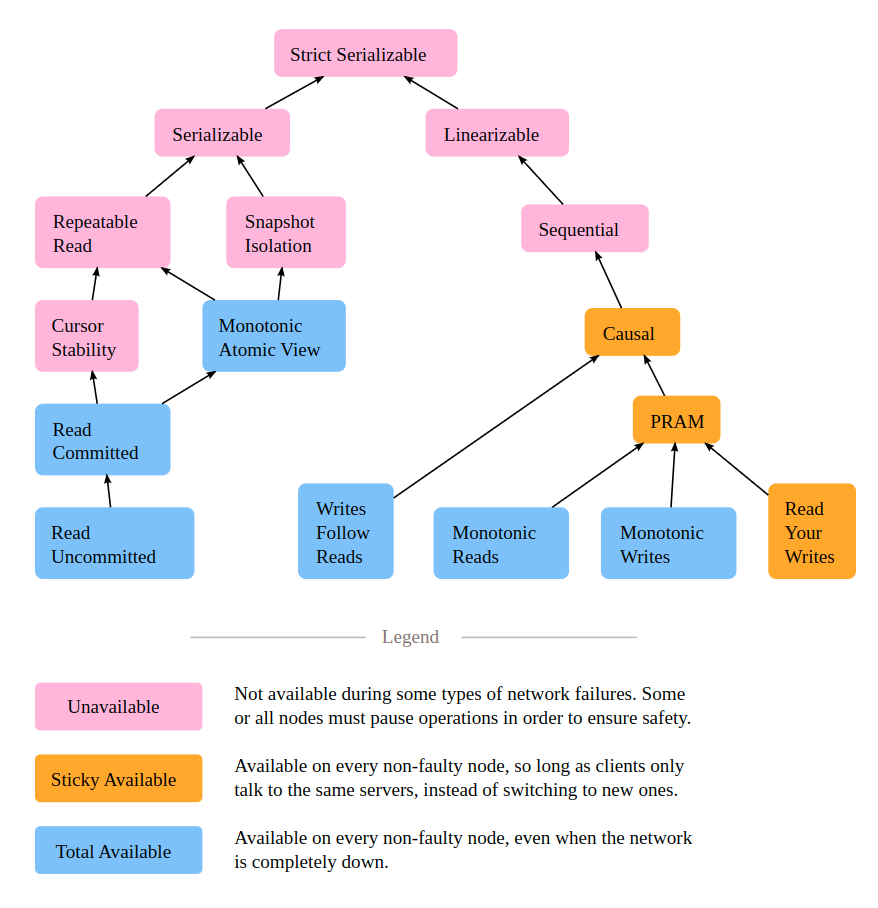

# 什么是强一致性问题？

## 目录

  - [#需要讨论的两个方面](#需要讨论的两个方面)
  - [#数据一致性](#数据一致性)
    - [；为什么要讨论这个](#为什么要讨论这个)
    - [；分析框架](#分析框架)
    - [；模型分类](#模型分类)
      - [&写后读一致性](#写后读一致性)
      - [&单调一致性](#单调一致性)
      - [&前缀一致性](#前缀一致性)
      - [&线性一致性Linearizability](#线性一致性linearizability)
      - [&因果一致性Causal Consistency](#因果一致性causal-consistency)
      - [&顺序一致性Sequential consistency](#顺序一致性sequential-consistency)
  - [#事务一致性](#事务一致性)
    - [；什么是事务](#什么是事务)
    - [；为什么会有“事务”](#为什么会有事务)
      - [&例子一：用户购买在线付费资源->事务的原子性](#例子一用户购买在线付费资源-事务的原子性)
      - [&例子二：用户购买操作并发执行->事务的隔离性](#例子二用户购买操作并发执行-事务的隔离性)
      - [&CPU原子操作与事务的原子性、隔离性](#cpu原子操作与事务的原子性隔离性)
    - [；事务的ACID特性](#事务的acid特性)
    - [；隔离性](#隔离性)
  - [#总结：强一致性](#总结强一致性)
  - [#参考](#参考)

## #需要讨论的两个方面#

------

对于分布式系统而言，**CAP的C是指多副本、单操作的数据一致性**。

而在数据库领域，“一致性”与事务密切相关，又进一步细化到 ACID 四个方面。**ACID里的C是指单副本、多操作的事务一致性**。

因此，当我们谈论分布式数据库的一致性时，实质上是在谈论**数据一致性和事务一致性两个方面**。（这一点，可以从 Google Spanner 对其外部一致性（External Consistency）的[论述](https://cloud.google.com/blog/products/databases/why-you-should-pick-strong-consistency-whenever-possible)中得到佐证）

## #数据一致性#

------

##### ；为什么要讨论这个

包括分布式数据库在内的分布式存储系统，为了避免设备与网络的不可靠带来的影响，通常会存储多个数据副本。一份数据同时存储在多个物理副本上，自然带来了数据一致性问题：若同时存在读操作和写操作，数据一致性如何保证？

多副本数据上的一组读写策略，被称为“一致性模型”（Consistency Model）。

##### ；分析框架

观察数据一致性的两个视角：状态和操作。（该说法来源于[论文](https://www.semanticscholar.org/paper/The-Many-Faces-of-Consistency-Aguilera-Terry/8d67a8f90586e3c074a60a871a210785ee61c43e?sort=relevance&citedPapersSort=relevance&citedPapersLimit=10&citedPapersOffset=20)“The many faces of consistency”）

状态上：两种，操作后，所有副本一致（强一致）或不一致（弱一致）。

- 强一致如MySQL的全同步复制 
  - 性能差：主库必须等到所有备库回应后才向用户反馈
  - 可用性问题：若单机可用性为P（P<1），集群串联的可用性为P的n次方，弱于单机
- 弱一致如NoSQL的最终一致性（BASE 理论中的 E：Eventually Consistency）：在主副本执行写操作并反馈成功时，不要求其他副本与主副本保持一致，但在**经过一段时间**后这些副本最终会追上主副本的进度，重新达到数据状态的一致。

操作上：如何讨论“经过一段时间”——在副本不一致的情况下，进行操作层面的封装来对外表现数据的状态。

##### ；模型分类

线性一致性 > 顺序一致性 > 因果一致性 > 最终一致性{ 写后读一致性，单调一致性，前缀一致性 .....}

###### &写后读一致性

自己写入成功的任何数据，下一刻一定能读取到，其内容保证与自己最后一次写入完全一致，这就是“读自己写一致性”名字的由来。当然，从旁观者角度看，可以称为“读你写一致性”（Read Your Writes Consistency），有些论文确实采用了这个名称。

1. 小明很喜欢在朋友圈分享自己的生活。这天是小明和女友小红的相识纪念日，小明特意在朋友圈分享了一张两人的情侣照。小明知道小红会很在意，特意又刷新了一下朋友圈，确认照片分享成功。
2. 在完成异步复制之前，小明只会访问主副本R1。

###### &单调一致性

一个用户一旦读到某个值，不会读到比这个值更旧的值。

1. 此时，小红也在刷朋友圈，看到了小明刚刚分享的照片，非常开心。然后，小红收到一条信息，简单回复了一下，又回到朋友圈再次刷新，发现照片竟然不见了！小红很生气，打电话质问小明，为什么这么快就把照片删掉？小明听了一脸蒙，心想我没有删除呀。
2. 为了解决这种问题，就必须实现单调一致性。
3. 假如，变量 X 被赋值三次，依次是 10、20、30；之后读取变量 X，如果第一次读到了 20，那下一次只有读到 20 或 30 才是合理的。因为在第一次读到 20 的一刻，意味着 10 已经是过期数据，没有意义了。

###### &前缀一致性

1. 这天小明去看NBA总决赛，刚开球小明就拍了一张现场照片发到朋友圈，想要炫耀一下。小红也很喜欢篮球，但临时有事没有去现场，就在评论区问小明：“现在比分是多少？”小明回复：“4:2。”小明的同学，远在加拿大的小刚，却看到了一个奇怪的现象，评论区先出现了小明的回复“4:2。”，而后才刷到小红的评论“现在比分是多少？”。难道小明能够预知未来吗？
2. 显然，问题与答案之间是有因果关系的，但这种关系在复制的过程中被忽略了，于是出现了异常。保持这种因果关系的一致性，被称为前缀读或前缀一致性（Consistent Prefix）。要实现这种一致性，可以考虑在原有的评论数据上增加一种显式的因果关系，这样系统可以据此控制在其他进程的读取顺序。

###### &线性一致性Linearizability

但在现实中，多数场景的因果关系更加复杂，也不可能要求全部做显式声明。更可靠的方式是将自然语意的因果关系转变为**事件发生的先后顺序**。在线性一致性下，整个系统表现得好像只有一个副本，所有操作被记录在一条时间线上，并且被原子化，这样任意两个事件都可以比较先后顺序。这些事件一起构成的集合，在数学上称为具有“**全序关系**”的集合，而“全序”也称为“线性序”。但是，集群中的各个节点不能做到真正的时钟同步，这样节点有各自的时间线。那么，如何将操作记录在一条时间线上呢？这就需要一个绝对时间，也就是**全局时钟**。

1. &工业界状况：从产品层面看，主流分布式数据库大多以实现线性一致性为目标，在设计之初或演进过程中纷纷引入了全局时钟，比如 Spanner、TiDB、OceanBase、GoldenDB 和巨杉等等。工程实现上，多数产品采用单点授时（TSO），也就是从一台时间服务器获取时间，同时配有高可靠设计； 而 Spanner 以全球化部署为目标，因为 TSO 有部署范围上的限制，所以 Spanner 的实现方式是通过 GPS 和原子钟实现的全局时钟，也就是 TrueTime，它可以保证在全球范围内任意节点能同时获得的一个绝对时间，误差在 7 毫秒以内。
2. &反对者：“时间是相对的”

总结，线性一致性必须要有全局时钟，全局时钟可能来自授时服务器或者特殊物理设备（如原子钟），全局时钟的实现方式会影响到集群的部署范围。

###### &因果一致性Causal Consistency

不依赖绝对时间，基础是**偏序关系**——至少一个节点内部的事件是可以排序的，依靠节点的本地时钟就行了；节点间如果发生通讯，则参与通讯的两个事件也是可以排序的，接收方的事件一定晚于调用方的事件。

1. &**逻辑时钟**：基于这种偏序关系，Leslie Lamport 在论文“[Time, Clocks, and the Ordering of Events in a Distributed System](https://lamport.azurewebsites.net/pubs/time-clocks.pdf)”中提出了逻辑时钟的概念。
2. &工业界状况：具体到分布式数据库领域，CockroachDB 和 YugabyteDB 都在设计中采用了**逻辑混合时钟**（Hybrid Logical Clocks），这个方案源自 Lamport 的逻辑时钟，也取得了不错的效果。因此，这两个产品都没有实现线性一致性，而是接近于因果一致性，其中 CockroachDB 将自己的一致性模型称为“No Stale Reads”。

总结：【线性一致性】必须要有全局时钟，全局时钟可能来自授时服务器或者特殊物理设备（如原子钟），全局时钟的实现方式会影响到集群的部署范围；【因果一致性】可以通过逻辑时钟实现，不依赖于硬件，不会限制集群的部署范围。

###### &顺序一致性Sequential consistency

较少在分布式数据库中使用。

## #事务一致性#

------

##### ；什么是事务

在数据库中，“事务”是由多个操作构成的序列。

##### ；为什么会有“事务”

###### &例子一：用户购买在线付费资源->事务的原子性

在非事务操作中，如果在权益发放时资源下架或服务器崩溃，但用户已经被扣费了，必不会认同这种结果。

###### &例子二：用户购买操作并发执行->事务的隔离性

你看上了Steam上的两款游戏，一款60，另一款80，你只有100，但是你通过某些方式进行同时购买，如果是非事务操作：同时判断、同时扣费，这时会出现超额支出的情况。

###### &CPU原子操作与事务的原子性、隔离性

【原子操作】是在单核 CPU 时代定义的，由于原子操作是不可中断的，那么系统在执行原子操作的过程中，唯一的 CPU 就被占用了，这就确保了原子操作的临界区，不会出现竞争的情况。原子操作自带了线程安全的保证，即最严格的隔离级别的可串行化，所以我们在编程的时候，就不需要对原子操作加锁，来保护它的临界区了。即**原子操作同时包含了原子性和隔离性两个概念**。

而对分布式数据库，由于相对于内存来说非常慢的磁盘，而可串行化地去操作磁盘，在很多业务场景下的性能是难以接受的，于是将隔离性分离出来：隔离性为了在性能和正确性之间权衡，定义了多种隔离级别，我们可以依据自己的业务情况进行选择。

##### ；事务的ACID特性

> **Atomicity:** Either all the changes from the transaction occur (writes, and messages sent), or none occur.
>
> > 原子性：一个事务所有的操作，要么全部执行，要么就一个都不执行，all-or-nothing。

A的实现依赖于隔离性的并发控制技术和持久性的日志技术。

> **Consistency:** The transaction preserves the integrity of stored information.
>
> > 一致性：一个事务能够正确地将数据从一个一致性的状态，变换到另一个一致性的状态。

C没有单独讨论的必要，它需要其他特性来协助完成，可以说是“事务”的整体目标。

> **Isolation:** Concurrently executing transactions see the stored information as if they were running serially (one after another).
>
> > 隔离性：多事务并行执行所得到的结果，与串行执行（一个接一个）完全相同。

> **Durability:** Once a transaction commits, the changes it made (writes and messages sent) survive any system failures.
>
> > 持久性：一旦事务提交，它对数据的改变将被永久保留，不应受到任何系统故障的影响。

D的目的就是应对系统故障，分两种情况讨论。

1. 【存储硬件无损、可恢复的故障】这种情况下，主要依托于预写日志（Write Ahead Log, WAL）保证第一时间存储数据。WAL 采用顺序写入的方式，可以保证数据库的低延时响应。WAL 是单体数据库的成熟技术，NoSQL 和分布式数据库都借鉴了过去。
2. 【存储硬件损坏、不可恢复的故障】这种情况下，需要用到日志复制技术，将本地日志及时同步到其他节点。实现方式大体有三种：
   1. 【单体数据库自带的同步或半同步的方式】，其中半同步方式具有一定的容错能力，实践中被更多采用；
   2. 【将日志存储到共享存储系统上】，后者会通过冗余存储保证日志的安全性，亚马逊的 Aurora 采用了这种方式，也被称为 Share Storage；
   3. 【基于 Paxos/Raft 的共识算法同步日志数据】，在分布式数据库中被广泛使用。无论采用哪种方式，目的都是保证在本地节点之外，至少有一份完整的日志可用于数据恢复。
   
   
   
   

##### ；隔离性

隔离性是事务的核心。降低隔离级别，其实就是在正确性上做妥协，将一些异常现象交给应用系统的开发人员去解决，从而获得更好的性能。所以，除“可串行化”以外的隔离级别，都有无法处理的异常现象。

最早、最正式的对隔离级别的定义，是 ANSI SQL-92（简称 SQL-92），它定义的四种隔离级别和三种异常现象如下所示：

但SQL-92对异常现象的分析还是过于简单了，所以在不久之后的 1995 年，Jim Gray 等人发表了论文“[A Critique of ANSI SQL Isolation Levels](https://www.microsoft.com/en-us/research/wp-content/uploads/2016/02/tr-95-51.pdf)”（以下简称 Critique），对于事务隔离性进行了更加深入的分析。

## #总结：强一致性#

------

在严格意义上，分布式数据库的“强一致性”意味着严格串行化（Strict Serializable），根据20年的文章，Spanner 达到了这个标准，其同时也带来了性能上的巨大开销。如果稍稍放松标准，那么“数据一致性”达到因果一致性（Causal）且“事务一致性”达到已提交读（Read Committed），即可认为是相对的“强一致性”（针对这点，不同人有不同见解，其本质原因是处理的工程问题不同）。当然，分布式数据一致性并不是越高越好，还要与可用性、性能指标结合，否则就成了形象工程。

图片原始出处是论文“Highly Available Transactions: Virtues and Limitations”，此处引用的是[Jepsen 网站的简化版](https://jepsen.io/consistency)。

## #参考#

https://time.geekbang.org/column/article/497528

https://time.geekbang.org/column/article/272999

http://kaiyuan.me/2018/04/21/consistency-concept

[A Critique of ANSI SQL Isolation Levels](https://www.microsoft.com/en-us/research/wp-content/uploads/2016/02/tr-95-51.pdf)

[Jepsen : Consistency Models ](https://jepsen.io/consistency)

[Spanner: Google’s Globally-Distributed Database](http://static.googleusercontent.com/media/research.google.com/zh-CN//archive/spanner-osdi2012.pdf)

